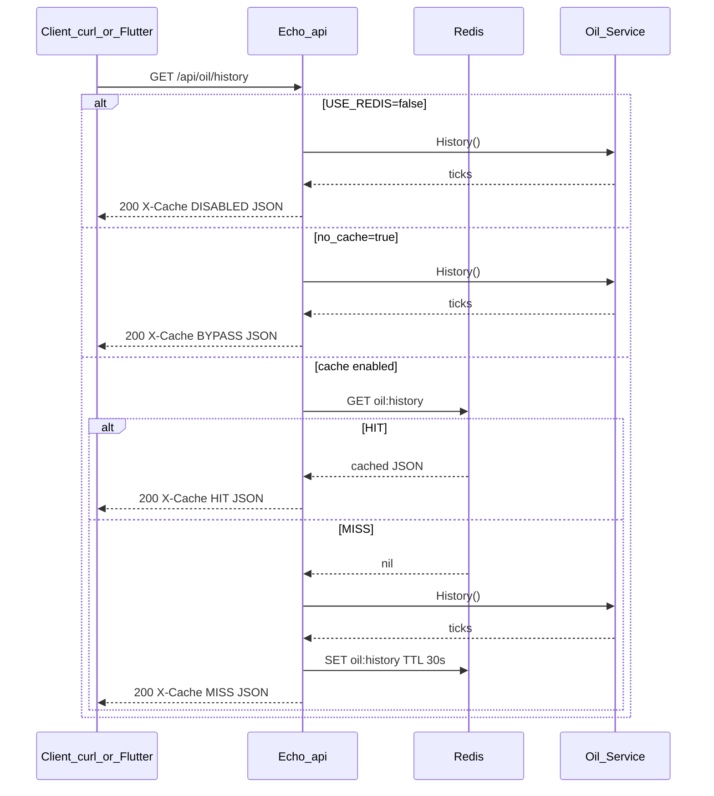

# OIL / Redis 実行・検証手順と PR の作り方

石油（OIL/USD）履歴 API の Redis キャッシュを、ローカルで確認するための手順です。あわせて、このリポジトリでのプルリクエスト（PR）作成手順も記載します。

## 1. 前提

| ツール | 用途 |
|--------|------|
| Docker Compose | `api` + `redis` の起動（`compose.yaml`） |
| curl | HTTP 検証（**GET** を使う） |
| `gh`（任意） | GitHub 上で PR を作成 |

リポジトリのルートで作業します。

## 2. 起動手順

```sh
docker compose up --build
```

起動ログに次が出ていれば Redis キャッシュは有効です。

```text
gas price API listening on http://localhost:8080 (update interval: 2s, use_redis: true)
```

別ターミナルで検証コマンドを実行します。停止は Compose 側で `Ctrl+C`（または `docker compose down`）です。

`task backend:dev` だけだと既定で `USE_REDIS=false` のため、履歴は常に `X-Cache: DISABLED` になります。Redis を試すときは Compose 起動を使ってください。

## 3. リクエスト → レスポンスの流れ



要点:

- キャッシュ対象は **`GET /api/oil/history` のみ**（WebSocket `/ws/oil` は対象外）
- 応答ヘッダ **`X-Cache`** で経路が分かる
- キャッシュ TTL は **30 秒**（環境変数 `REDIS_TTL`、Compose 既定 `30s`）

## 4. 検証コマンドとレスポンス例

### 4.1. HEAD（`curl -I`）は使わない

この API は `GET` のみ登録しています。`curl -sI`（HEAD）は **405 Method Not Allowed** になり、`X-Cache` は付きません。

```sh
# NG: HEAD
curl -sI http://localhost:8080/api/oil/history
```

### 4.2. ヘッダだけ確認する（推奨）

```sh
curl -sD - -o /dev/null http://localhost:8080/api/oil/history
```

**1 回目の例（キャッシュなし → 書き込み）:**

```http
HTTP/1.1 200 OK
Content-Type: application/json
X-Cache: MISS
Date: Sat, 01 Aug 2026 12:27:11 GMT
Transfer-Encoding: chunked
```

**すぐ続けた 2 回目の例（キャッシュヒット）:**

```http
HTTP/1.1 200 OK
Content-Type: application/json
X-Cache: HIT
Date: Sat, 01 Aug 2026 12:27:12 GMT
Transfer-Encoding: chunked
```

### 4.3. 本文（JSON）の例

```sh
curl -s http://localhost:8080/api/oil/history | head -c 400
echo
```

レスポンス本文の形:

```json
[
  {
    "symbol": "OIL/USD",
    "price": 78.42,
    "timestamp": 1718293847123,
    "status": "UP"
  },
  {
    "symbol": "OIL/USD",
    "price": 78.10,
    "timestamp": 1718293849123,
    "status": "DOWN"
  }
]
```

| フィールド | 説明 |
|------------|------|
| `symbol` | 常に `OIL/USD` |
| `price` | 価格 |
| `timestamp` | Unix 時刻（ミリ秒） |
| `status` | `UP` / `DOWN` / `EQUAL` |

現在値だけの API:

```sh
curl -s http://localhost:8080/api/oil
```

```json
{
  "symbol": "OIL/USD",
  "price": 78.42,
  "timestamp": 1718293847123,
  "status": "UP"
}
```

### 4.4. キャッシュバイパス

Flutter の Redis トグル OFF 時と同様に、クエリでバイパスできます。

```sh
curl -sD - -o /dev/null 'http://localhost:8080/api/oil/history?no_cache=true'
```

```http
HTTP/1.1 200 OK
Content-Type: application/json
X-Cache: BYPASS
```

この場合 Redis には書き込みません。

### 4.5. Redis 側の確認

```sh
docker compose exec redis redis-cli PING
# → PONG

# MISS 直後なら JSON が入る（30 秒以内）
docker compose exec redis redis-cli GET oil:history

# 残り秒数。正の整数 = キーあり、-2 = キーなし
docker compose exec redis redis-cli TTL oil:history
```

一連の確認例:

```sh
curl -sD - -o /dev/null http://localhost:8080/api/oil/history
docker compose exec redis redis-cli TTL oil:history
curl -sD - -o /dev/null http://localhost:8080/api/oil/history
```

期待: 1 回目 `MISS` + TTL が正の整数 → 2 回目 `HIT`。

## 5. `X-Cache` 早見表

| 値 | 意味 |
|----|------|
| `HIT` | Redis から返却 |
| `MISS` | Redis に無かったのでサービス直読し、キャッシュへ書き込み |
| `BYPASS` | `?no_cache=true` で Redis を使わず直読（書き込みなし） |
| `DISABLED` | サーバー側で Redis 未使用（`USE_REDIS=false` や起動時 Ping 失敗） |

## 6. プルリクエストの作成手順

このリポジトリで変更を PR にする標準的な流れです。

### 6.1. ブランチを切ってコミット

```sh
git checkout main
git pull origin main
git checkout -b docs/your-topic   # 例: docs/oil-redis-howto

# ファイルを編集したあと
git status
git add path/to/changed/files
git commit -m "docs: short summary of why"
```

### 6.2. リモートへ push して PR を作成

[`gh`](https://cli.github.com/) を使う場合:

```sh
git push -u origin HEAD

gh pr create \
  --base main \
  --title "docs: add OIL/Redis verification and PR howto" \
  --body "$(cat <<'EOF'
## Summary
- OIL/Redis の起動・検証手順を追加
- リクエスト/レスポンス例と X-Cache の見方を記載
- 本リポジトリでの PR 作成手順を記載

## Test plan
- [ ] docs/oil_redis_howto.md の手順どおり docker compose で確認できる
- [ ] GET で X-Cache が MISS → HIT になる
EOF
)"
```

`gh` が無い場合:

```sh
git push -u origin HEAD
```

その後ブラウザで GitHub が案内する Compare & pull request から PR を作成します。  
例: `https://github.com/sakurakotubaki/gas_pulse/compare/main...docs/your-topic`

### 6.3. レビューからマージまで

1. PR ページで Files changed / Conversation を確認する  
2. CI や CodeRabbit などのコメントがあれば対応し、必要なら追加コミットを同じブランチへ `git push` する  
3. レビュー承認後、**Squash and merge** または **Merge** で `main` に取り込む  
4. ローカルを更新する:

```sh
git checkout main
git pull origin main
```

作業ブランチが不要なら削除して構いません。

```sh
git branch -d docs/your-topic
git push origin --delete docs/your-topic
```

## 関連

- バックエンド概要: [`backend/README.md`](../backend/README.md)
- Compose 定義: [`compose.yaml`](../compose.yaml)
- 設計書（マージ状況により存在）: [`docs/sdd_oil_redis.md`](./sdd_oil_redis.md)
