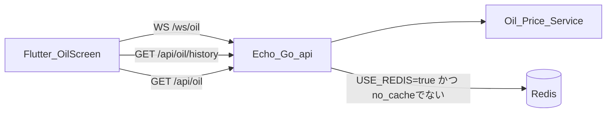
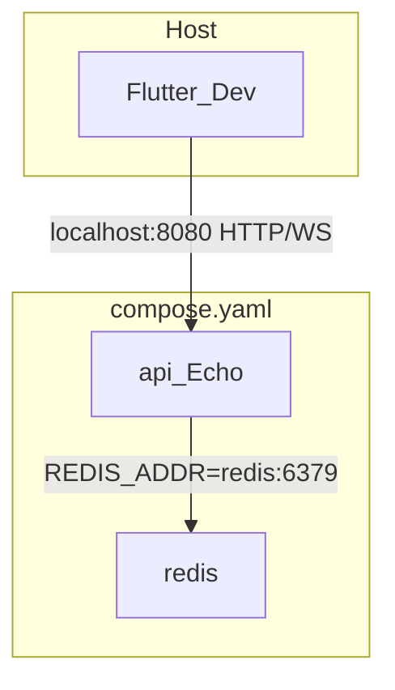
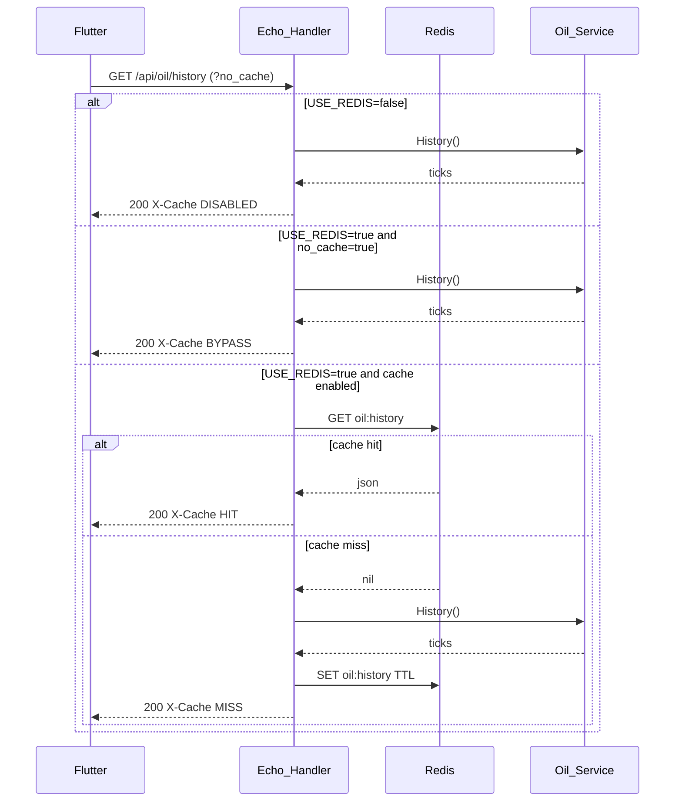
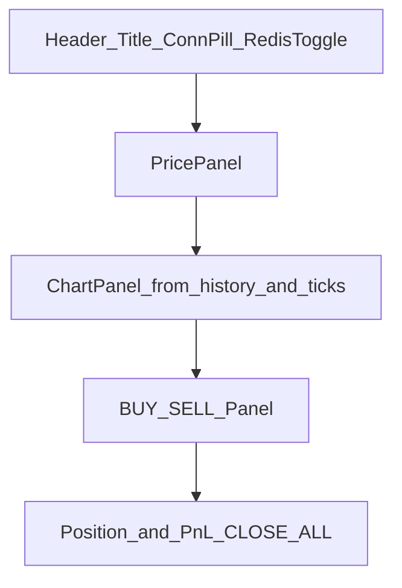

# SDD: 石油（OIL/USD）取引機能および Redis キャッシュ ON/OFF 機構

| 項目 | 内容 |
|------|------|
| ドキュメント種別 | Software Design Document（ソフトウェア詳細設計書） |
| 対象リポジトリ | `gas_pulse` |
| ステータス | Draft（実装前） |
| 関連ブランチ | `feature/oil-trading-redis` |

---

## 1. 概要と目的

### 1.1. 背景

既存デモアプリは天然ガス（NGAS/USD）、仮想東証（TSE-DEMO）、金（XAU/USD）のリアルタイム表示を提供している。バックエンドは Go / Echo のインメモリ価格シミュレーションであり、永続ストア・Docker・Redis は未導入である。

### 1.2. 目的

本設計の目的は次の機能を追加することである。

1. **石油（OIL/USD）リアルタイム取引画面（Flutter）**
   - 既存アプリに石油取引用の単一ページ（タブ）を追加する。
   - WebSocket によるリアルタイム価格表示、BUY / SELL、クライアント側の建玉・損益計算を行う。
   - ヘッダーに「Redis Cache ON/OFF」トグルを配置する。

2. **Redis キャッシュおよびトグル機構（Go / Echo / Docker）**
   - チャート履歴 API（`GET /api/oil/history`）取得時に Redis キャッシュを利用する。
   - 二層の ON/OFF 制御を行う。
     - サーバー全体制御: 環境変数 `USE_REDIS=true|false`（`compose.yaml` で管理）
     - API 単位の個別バイパス: クエリパラメータ `?no_cache=true`（Flutter ヘッダーのトグル OFF 時に付与）
   - Echo アプリと Redis を `compose.yaml` で構成する。

### 1.3. スコープ外

- 注文のサーバー永続化・約定エンジン・口座システム
- WebSocket 配信データの Redis キャッシュ
- gas / gold / stocks 既存 API への Redis 適用（本フェーズは OIL history のみ）
- 本番向け認証・TLS・Origin 制限の強化

### 1.4. 設計方針（既存コードとの整合）

| 領域 | 鏡映元 |
|------|--------|
| Backend OIL サービス / Tick | `backend/internal/gold/` |
| HTTP / WS ルート | `backend/internal/httpapi/handler.go` |
| Flutter tick feed | `app/lib/src/features/gold/` |
| BUY / SELL UI | `app/lib/src/features/stocks/presentation/stock_screen.dart` |
| タブ追加 | `app/lib/src/navigation/app_shell.dart` |

Compose ファイル名は Docker Compose の現行推奨に合わせ **`compose.yaml`** とする（参考: [Docker Compose getting started](https://docs.docker.com/compose/gettingstarted/)）。

---

## 2. 全体アーキテクチャ

### 2.1. コンポーネント構成



### 2.2. Docker Compose 環境



| サービス | イメージ / ビルド | 公開ポート | 主な環境変数 |
|----------|-------------------|------------|--------------|
| `api` | `backend/Dockerfile` からビルド | `8080:8080` | `PORT`, `USE_REDIS`, `REDIS_ADDR`, `REDIS_TTL`, `OIL_INITIAL_PRICE`, `PRICE_UPDATE_INTERVAL` |
| `redis` | `redis:7-alpine` | `6379:6379`（開発用） | 既定 |

Flutter はホスト側で起動し、既存どおり `BACKEND_HOST` / `BACKEND_PORT` / `BACKEND_SCHEME`（既定 `localhost` / `8080` / `ws`）で API に接続する。

### 2.3. ランタイムデータフロー（要約）

1. `api` 起動時に OIL 価格サービスを goroutine で起動し、`PRICE_UPDATE_INTERVAL` 間隔で Tick を更新する。
2. 購読中の WebSocket クライアントへ最新 Tick を fan-out する（キャッシュ対象外）。
3. `GET /api/oil/history` は `USE_REDIS` と `no_cache` に応じて Redis 経由またはサービス直読で履歴を返す。
4. Flutter OIL 画面は WS で価格・PnL を更新し、履歴チャート用に history REST を取得する。ヘッダーのトグルが history の `no_cache` を制御する。

---

## 3. Redis ON/OFF 切り替えシークエンス

### 3.1. 判定優先順位

ハンドラーは次の順で分岐する。

1. `USE_REDIS=false` → Redis を使わず常に `oil.History()`（応答ヘッダ `X-Cache: DISABLED`）。Redis 未接続で起動可能。
2. `USE_REDIS=true` かつ `?no_cache=true` → Bypass。サービス直読し、**キャッシュ書き込みもしない**（`X-Cache: BYPASS`）。
3. `USE_REDIS=true` かつ cache 有効 → Redis `GET oil:history`
   - Hit → キャッシュ値を返却（`X-Cache: HIT`）
   - Miss → `oil.History()` → Redis `SET`（TTL 付き）→ 返却（`X-Cache: MISS`）

### 3.2. フロー図



### 3.3. トグル対応表

| サーバー `USE_REDIS` | クライアント トグル | クエリ | 挙動 |
|----------------------|---------------------|--------|------|
| `false` | ON / OFF どちらでも | 任意 | 常に DISABLED（直読） |
| `true` | ON（キャッシュ利用） | なし | HIT / MISS |
| `true` | OFF（バイパス） | `no_cache=true` | BYPASS |

Flutter 側トグルの意味は「**このリクエストでキャッシュを使いたいか**」である。サーバー全体の Redis 無効化は `compose.yaml` の `USE_REDIS` で行う。

### 3.4. 障害時フォールバック

`USE_REDIS=true` でも Redis 接続エラー時はログを出し、サービス直読で応答する（`X-Cache: BYPASS` または `MISS` 扱いとし、ユーザー向け 5xx にしない）。デモ継続性を優先する。

---

## 4. バックエンド設計 (Go / Echo)

### 4.1. パッケージ構成（追加予定）

```
backend/
├── Dockerfile                 # 新規
├── main.go                    # OIL / Redis 配線を追加
├── internal/
│   ├── oil/                   # 新規（gold 同型）
│   │   └── service.go
│   ├── cache/                 # 新規（Redis クライアント抽象）
│   │   └── redis.go
│   └── httpapi/
│       └── handler.go         # OIL ルート・history キャッシュ判定
compose.yaml                   # リポジトリルートに新規
```

### 4.2. データ構造

gold と同型の Tick を用いる。

```go
type Tick struct {
    Symbol    string  `json:"symbol"`
    Price     float64 `json:"price"`
    Timestamp int64   `json:"timestamp"` // Unix ms
    Status    string  `json:"status"`    // UP | DOWN | EQUAL
}
```

| 項目 | 値 |
|------|-----|
| Symbol | `OIL/USD` |
| 履歴上限 | 120 件 |
| 価格精度 | 小数第 2 位（想定。実装時に gold に合わせて調整可） |
| 初期価格 env | `OIL_INITIAL_PRICE`（例: `78.50`） |
| 価格帯（シミュレーション） | 例: 60.0 〜 120.0 |

`Service` は gold と同様に `Current()` / `History()` / `Subscribe()` / `Run(ctx)` / `UpdateNow()` を提供する。

### 4.3. Redis クライアントの初期化

`main.go` 起動時:

1. `useRedis := envBool("USE_REDIS", false)`
2. `useRedis == false` の場合、Redis クライアントは生成せず `Handler` に `nil`（または no-op）を渡す。
3. `useRedis == true` の場合:
   - `REDIS_ADDR`（既定 `localhost:6379`、Compose 内は `redis:6379`）
   - `REDIS_TTL`（既定 `30s`）
   - go-redis 等で接続。Ping 失敗時は警告ログ + フォールバック直読モードでもよい。

キャッシュキー:

| キー | 値 | TTL |
|------|-----|-----|
| `oil:history` | `[]Tick` の JSON 配列 | `REDIS_TTL` |

価格更新のたびに history が変わるため、TTL は短め（30s）とし、必要なら将来 `UpdateNow` 後に `DEL oil:history` で無効化する拡張を許容する（本 SDD の必須要件ではない）。

### 4.4. ハンドラーロジック

`Register` に以下を追加する。

| Method | Path | Handler |
|--------|------|---------|
| GET | `/api/oil` | 現在値（キャッシュなし） |
| GET | `/api/oil/history` | 履歴（Redis 判定あり） |
| GET | `/ws/oil` | Tick ストリーム（gold 同パターン） |

`/api/oil/history` の疑似コード:

```go
func (h *Handler) oilHistory(c echo.Context) error {
    noCache := c.QueryParam("no_cache") == "true"

    if !h.useRedis || h.cache == nil {
        c.Response().Header().Set("X-Cache", "DISABLED")
        return c.JSON(http.StatusOK, h.oil.History())
    }
    if noCache {
        c.Response().Header().Set("X-Cache", "BYPASS")
        return c.JSON(http.StatusOK, h.oil.History())
    }

    if raw, ok := h.cache.Get(c.Request().Context(), "oil:history"); ok {
        c.Response().Header().Set("X-Cache", "HIT")
        return c.Blob(http.StatusOK, "application/json", raw)
    }

    ticks := h.oil.History()
    _ = h.cache.SetJSON(c.Request().Context(), "oil:history", ticks, h.redisTTL)
    c.Response().Header().Set("X-Cache", "MISS")
    return c.JSON(http.StatusOK, ticks)
}
```

WebSocket `/ws/oil` は既存 `/ws/gold` と同じ手順とする。

1. Upgrade → Subscribe  
2. 直後に `Current()` を 1 件送信  
3. 更新チャンネルで push  
4. 30s Ping  
5. 切断で Unsubscribe  

### 4.5. `compose.yaml` の設定仕様

リポジトリルートに配置する想定。

```yaml
services:
  api:
    build:
      context: ./backend
    ports:
      - "8080:8080"
    environment:
      PORT: "8080"
      USE_REDIS: "true"
      REDIS_ADDR: "redis:6379"
      REDIS_TTL: "30s"
      OIL_INITIAL_PRICE: "78.50"
      PRICE_UPDATE_INTERVAL: "2s"
    depends_on:
      - redis

  redis:
    image: redis:7-alpine
    ports:
      - "6379:6379"
```

補足:

- ローカルで Redis なし検証する場合は `USE_REDIS: "false"` に変更する（`redis` サービスは起動したままでも、API は接続しない）。
- `Dockerfile` は multi-stage（`golang` builder → 軽量 runtime）を推奨する。
- Compose ファイル名は **`compose.yaml`**（`docker compose up` が自動検出）。

### 4.6. 環境変数一覧（OIL / Redis 関連）

| 変数 | 既定 | 説明 |
|------|------|------|
| `USE_REDIS` | `false` | Redis キャッシュ全体スイッチ |
| `REDIS_ADDR` | `localhost:6379` | Redis アドレス |
| `REDIS_TTL` | `30s` | history キャッシュ TTL |
| `OIL_INITIAL_PRICE` | `78.50` | OIL 初期価格 |
| `PRICE_UPDATE_INTERVAL` | `1m`（既存） | OIL 含む全サービスの更新間隔 |
| `PORT` | `8080` | HTTP 待受 |

---

## 5. フロントエンド設計 (Flutter)

### 5.1. 機能配置

```
app/lib/src/features/oil/
├── application/
│   └── oil_feed.dart          # keepAlive WS feed（+ generated）
├── data/
│   ├── oil_price_repository.dart   # WebSocket
│   └── oil_history_repository.dart # REST history
├── domain/
│   ├── oil_price_tick.dart
│   └── oil_state.dart
└── presentation/
    └── oil_screen.dart
```

`AppShell`（`app/lib/src/navigation/app_shell.dart`）に 4 つ目のタブ `OIL` と `OilScreen` を追加する。

```
ENERGY | TSE DEMO | GOLD | OIL
```

`IndexedStack` を維持し、タブ切替でも feed を破棄しない（`keepAlive: true` と整合）。

### 5.2. UI 構成

石油取引画面は 1 ページ完結とし、上から次を配置する。



| 領域 | 内容 |
|------|------|
| Header | 銘柄 `OIL/USD`、接続状態 pill（LIVE / CONNECTING）、**Redis Cache Switch** |
| Price | 現在価格、騰落表示（既存 `AppColors.positive` / `negative`） |
| Chart | history + 直近 ticks を `fl_chart` で描画 |
| Trade | BUY（買い）/ SELL（売り）巨大ボタン |
| Position | 建玉一覧、リアルタイム評価損益、CLOSE ALL |

wide レイアウト（例: width ≥ 900）では Price と Chart を横並びにする（gold / market と同様）。

### 5.3. Riverpod 状態管理とトグル

| Provider | 役割 |
|----------|------|
| `redisCacheEnabledProvider` | `bool`。既定 `true`。Header Switch が更新 |
| `oilFeedProvider` | `@Riverpod(keepAlive: true)`。`/ws/oil` 購読、再接続、`OilState` |
| `oilHistoryProvider` | `redisCacheEnabledProvider` を watch。`GET /api/oil/history`。OFF 時は `?no_cache=true` を付与して再取得 |

トグル処理:

1. ユーザーが Switch を OFF にする → `redisCacheEnabledProvider = false`
2. `oilHistoryProvider` が再実行され `.../api/oil/history?no_cache=true` を呼ぶ
3. Switch を ON に戻す → クエリなしで再取得（サーバー側で HIT/MISS）

WS 接続自体はトグルの影響を受けない（リアルタイム価格は常にライブ）。

### 5.4. 取引（クライアント側デモ）

サーバー注文 API は設けない。画面ローカル（または feature 内 Notifier）で次を保持する。

```dart
class OilPosition {
  final String side; // BUY | SELL
  final double entryPrice;
  final DateTime openedAt;
  // lot / size はデモ固定でも可
}
```

- BUY / SELL: 現在価格で建玉を追加。Haptic / SnackBar 等のフィードバック。
- PnL: 最新 Tick のたびに再計算。  
  - BUY: `(current - entry) * size`  
  - SELL: `(entry - current) * size`
- CLOSE ALL: 建玉クリア。デモ口座残高への反映は UI 表示のみでよい。

既存 stocks の `_ExecutionPanel`（「デモ表示です。実際の注文は送信されません」）と同系統のコピーを用いる。

### 5.5. エンドポイント解決

既存 gold / market と同じ `BACKEND_HOST` / `BACKEND_PORT` / `BACKEND_SCHEME` パターンを踏襲する。

| 用途 | Path |
|------|------|
| WS | `/ws/oil` |
| 現在値（任意） | `/api/oil` |
| 履歴 | `/api/oil/history` |

Android エミュレータでは既存どおり `10.0.2.2` 置換を踏襲する。

---

## 6. API / WebSocket 仕様書

### 6.1. エンドポイント一覧（追加分）

| HTTP メソッド | エンドポイント | 役割 | キャッシュ |
|---------------|----------------|------|------------|
| GET | `/api/oil` | 現在の OIL 価格 | なし |
| GET | `/api/oil/history` | 起動後の価格履歴（最大 120 件） | Redis（条件付き） |
| GET | `/ws/oil` | OIL 価格の WebSocket ストリーム | なし |
| GET | `/health` | 稼働確認（既存） | なし |

### 6.2. `GET /api/oil`

**レスポンス 200**

```json
{
  "symbol": "OIL/USD",
  "price": 78.42,
  "timestamp": 1718293847123,
  "status": "UP"
}
```

| フィールド | 型 | 説明 |
|------------|-----|------|
| `symbol` | string | 常に `OIL/USD` |
| `price` | number | 現在価格 |
| `timestamp` | number | Unix ミリ秒 |
| `status` | string | `UP` \| `DOWN` \| `EQUAL` |

### 6.3. `GET /api/oil/history`

**クエリ**

| パラメータ | 必須 | 説明 |
|------------|------|------|
| `no_cache` | 任意 | `true` のとき Redis をバイパス |

**レスポンス 200**

```json
[
  {
    "symbol": "OIL/USD",
    "price": 78.10,
    "timestamp": 1718293800000,
    "status": "EQUAL"
  },
  {
    "symbol": "OIL/USD",
    "price": 78.42,
    "timestamp": 1718293847123,
    "status": "UP"
  }
]
```

**レスポンスヘッダ**

| ヘッダ | 値 |
|--------|-----|
| `X-Cache` | `HIT` \| `MISS` \| `BYPASS` \| `DISABLED` |

### 6.4. `GET /ws/oil`

- プロトコル: WebSocket（既存と同様 `gorilla/websocket`）
- 接続直後: 現在 Tick を 1 件 JSON 送信
- 以降: 価格更新のたびに Tick JSON を push
- メッセージ形は `GET /api/oil` と同一

### 6.5. エラー

| 状況 | 振る舞い |
|------|----------|
| Redis 一時障害 | history は直読で 200。ログに警告 |
| WS Origin | 既存どおり開発向けに許可（将来強化） |
| 不正クエリ | `no_cache` は `true` 以外を false 扱い |

### 6.6. 検証観点（実装後）

1. `USE_REDIS=false` で history が `X-Cache: DISABLED` になること  
2. `USE_REDIS=true` で連続 GET が `MISS` → `HIT` になること  
3. `?no_cache=true` で常に `BYPASS` かつ HIT が増えないこと  
4. Flutter トグル OFF でリクエスト URL に `no_cache=true` が付くこと  
5. `/ws/oil` が gold 同様に接続直後 1 件 + 更新配信すること  
6. BUY / SELL / PnL / CLOSE ALL がクライアントのみで完結すること  

---

## 付録 A. 実装タスク（後続）

本ドキュメント承認後の実装順序案:

1. `backend/internal/oil` + handler ルート（Redis なしで動作確認）  
2. `backend/internal/cache` + `USE_REDIS` / `no_cache`  
3. `backend/Dockerfile` + ルート `compose.yaml`  
4. Flutter `features/oil` + `AppShell` タブ  
5. Header トグルと history repository 連携  
6. BUY / SELL / PnL UI  

## 付録 B. 関連既存ドキュメント

- ルート [`README.md`](../README.md) — 初期ガス取引デモ仕様  
- [`backend/README.md`](../backend/README.md) — バックエンド起動・検証  
